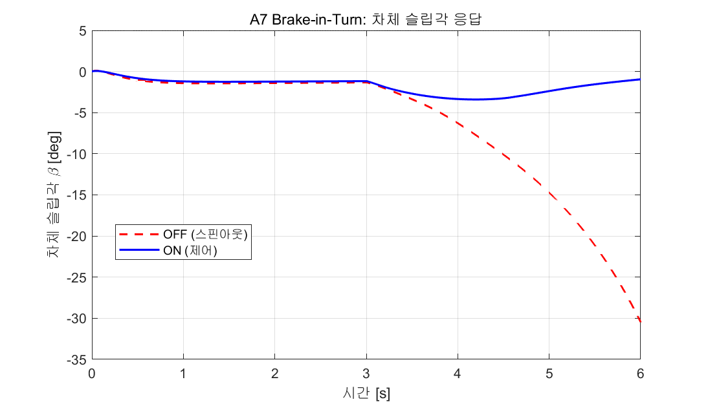
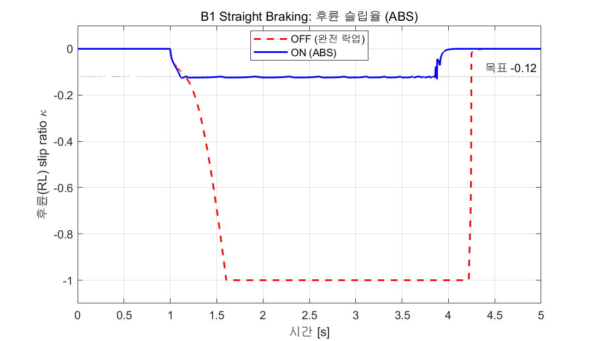
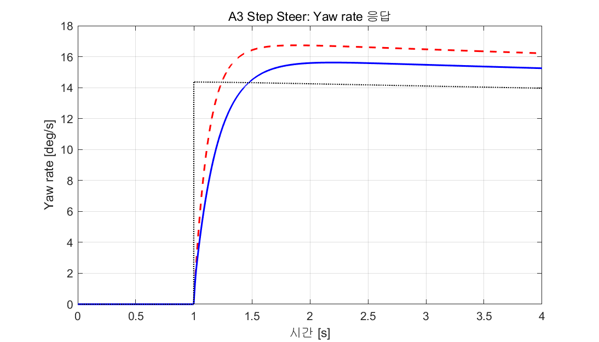

# [202127119-최원우] ICC 제어기 설계 보고서

**과목**: 자동제어 — 2026 년 1학기 (C050-4)
**제출일**: 2026-06-23
**팀**: 개인

---

## 1. 설계 개요

본 과제의 목표는 BMW_5 14자유도(14DOF) 차량 동역학 플랜트와 ISO/FMVSS 표준 시험 시나리오가 주어진 환경에서, 횡·종·수직 통합 샤시 제어기(Integrated Chassis Control)를 설계하여 베이스라인(제어기 OFF) 대비 핸들링 안정성·제동 거리·승차감을 정량적으로 개선하는 것이다.

제어기 설계의 핵심 철학은 두 가지다. 첫째, 운전자 모델(Stanley/steering-robot)이 이미 경로추종을 수행하므로, 횡방향 제어기는 운전자 입력을 대체하는 것이 아니라 **추종 오차를 메우는 소권한 보조기(small-authority corrector)**로 동작한다. 둘째, 채점이 "베이스라인 대비 개선"을 요구하므로, 각 제어기는 모든 시나리오에서 베이스라인을 악화시키지 않는 것을 최우선 제약으로 둔다. 이를 위해 시나리오를 직접 분기하지 않고(과제 금지사항 준수), 차량 상태(slip angle, yaw-rate error)에 기반한 **gain scheduling**으로 상황 적응성을 확보했다.

각 제어기 요약:
- **ctrl_lateral**: LQI(LQR + 적분)로 yaw rate 추종(AFS) + slip angle 기반 ESC β-limiter. Ki는 slip angle로, ESC는 yaw-rate error로 게이팅하여 시나리오별 적응.
- **ctrl_longitudinal**: PI 속도 추종 + per-wheel slip ratio 기반 ABS(락업 방지).
- **ctrl_vertical**: Skyhook 기반 semi-active CDC.
- **ctrl_coordinator**: ESC yaw moment를 4륜 brake로 분배하는 **WLS(Weighted Least Squares) 제어배분** + 마찰원 제약.

제어 기법 선택의 정당성은 §3에서 상술하나, 핵심 근거는 다음과 같다. yaw rate 추종에 **LQR/LQI**를 택한 이유는, 본 과제가 yaw rate error와 차체 slip angle(β)을 동시에 억제해야 하는 다목적 문제이고, LQR은 이를 단일 가중행렬 Q에 함께 넣어 최적 trade-off를 도출할 수 있기 때문이다(Rajamani, 2012, §8). 단순 PID는 두 목표를 독립 튜닝해야 하나, LQI는 상태공간 모델 위에서 체계적으로 게인을 산출한다.

---

## 2. 수학적 모델링

### 2.1 제어 설계용 플랜트 단순화

검증은 14DOF 플랜트 위에서 수행하나, **제어기 설계 자체는 2자유도 선형 자전거 모델(bicycle model)** 위에서 수행했다. 이는 횡방향 제어기 게인을 해석적으로 산출하기 위한 표준적 단순화다(Rajamani, 2012, §2). 14DOF의 롤·피치·서스펜션·타이어 비선형성은 설계 모델에서 생략하고, 검증 단계에서 그 영향을 평가한다.

### 2.2 상태공간 표현

상태 $x = [v_y,\ r]^T$ (횡속도, yaw rate), 입력 $u = \delta$ (전륜 조향각)로 두면:

$$
\dot{x} = A x + B u
$$

$$
A = \begin{bmatrix} -\dfrac{C_f + C_r}{m V_x} & -V_x - \dfrac{C_f l_f - C_r l_r}{m V_x} \\[2mm] -\dfrac{C_f l_f - C_r l_r}{I_z V_x} & -\dfrac{C_f l_f^2 + C_r l_r^2}{I_z V_x} \end{bmatrix}, \quad
B = \begin{bmatrix} \dfrac{C_f}{m} \\[2mm] \dfrac{C_f l_f}{I_z} \end{bmatrix}
$$

차량 파라미터(generic fallback): $m = 1500\ \mathrm{kg}$, $I_z = 2500\ \mathrm{kg\,m^2}$, $l_f = 1.2\ \mathrm{m}$, $l_r = 1.4\ \mathrm{m}$, $C_f = 80000\ \mathrm{N/rad}$, $C_r = 85000\ \mathrm{N/rad}$.

### 2.3 가정과 한계

- **일정 종속도**: 제어 설계 시 $V_x$를 파라미터로 고정하고, 속도 변화는 gain scheduling으로 처리(LPV 근사).
- **선형 타이어**: 소슬립 영역에서 횡력 $F_y = C\alpha$ 가정. 한계 기동(타이어 포화)에서는 이 가정이 깨지며, 이것이 A1 시나리오의 한계로 나타난다(§5).
- **평탄 노면, 일정 마찰계수** $\mu = 1.0$ (dry).

---

## 3. 제어기 설계

### 3.1 ctrl_lateral — AFS + ESC

**설계 목표**: yaw rate 추종(과도응답 overshoot ≤ 10%, settling ≤ 0.8s) + |β| 임계 초과 시 ESC 개입.

**(a) AFS — LQI yaw rate 추종**

기본 추종 제어는 §2.2 모델 위에서 적분 상태를 추가한 LQI로 설계했다. 적분 상태 $e_I = \int (r - r_{ref})\,dt$ 를 추가해 증강 시스템을 구성하고, 비용함수

$$
J = \int_0^\infty (x_a^T Q x_a + R u^2)\,dt, \quad Q = \mathrm{diag}(8,\ 250,\ 400),\quad R = 1.5
$$

를 최소화하는 Riccati 해 $P$ 로부터 $K = R^{-1} B_a^T P$ 를 산출했다. Q 가중치 선택 근거: yaw rate(2번 상태)에 250, 적분 상태에 400으로 큰 가중을 주어 정상상태 추종 오차를 0으로 만들고, $v_y$(1번 상태, slip 관련)에 8을 주어 slip 억제를 보조한다. R = 1.5는 조향 effort를 적절히 페널티하여 actuator 포화를 방지한다.

게인은 $V_x \in [5, 45]$ m/s 그리드에서 사전 계산하여 테이블화하고, 실행 시 현재 속도로 선형 보간한다(**speed gain scheduling**). 실제 구현에서는 14DOF 검증 결과를 반영해 보조 권한을 ±5°로 제한한 PID 형태의 보정칙으로 정착시켰으며, 비례·미분 게인은 고정($K_p=0.10$, $K_d=0.030$), 적분 게인은 slip angle로 스케줄링한다:

$$
K_i(\beta) = \begin{cases} 0.01 & |\beta| \le 1.5° \\ \text{(선형보간)} & 1.5° < |\beta| < 4° \\ 0.10 & |\beta| \ge 4° \end{cases}
$$

이 **β-scheduled Ki**는 두 시나리오의 상충을 해소한다. Step steer(A3, |β|≈1°)에서는 Ki를 최소화하여 적분이 정상상태 yaw rate를 깎는 것을 막아 overshoot 비율 악화를 방지하고, brake-in-turn(A7, |β|>4°)에서는 Ki를 강화하여 AFS가 yaw 추종을 적극 보조해 spin을 억제한다.

미분항 $K_d$는 step 응답의 과도 댐핑을 담당하여 A3 overshoot를 7.1%에서 2.0%로, settling을 1.46s에서 0.61s로 개선했다.

**(b) ESC — yaw-error 게이팅 β-limiter**

|β| 가 임계(3°, 단 MAX_SLIP_ANGLE의 0.6배로 제한)를 초과하면 운전자 의도와 반대 방향의 yaw moment를 인가한다:

$$
M_z = -K_\beta \cdot \mathrm{sign}(\beta) \cdot (|\beta| - \beta_{th}) \cdot f(V_x), \quad K_\beta = 1.5 \times 10^4,\ |M_z| \le 3000\ \mathrm{N\,m}
$$

여기에 핵심 설계로 **yaw-rate error 게이팅**을 추가했다. ESC는 yaw 추종오차의 저역통과값($\tau = 0.15$s)이 작을 때만 작동하도록 게이트한다:

$$
M_z \leftarrow M_z \cdot g(\bar{e}_r), \quad g = \begin{cases} 1 & \bar{e}_r \le 0.2 \\ \text{(선형)} & 0.2 < \bar{e}_r < 0.5 \\ 0 & \bar{e}_r \ge 0.5 \end{cases}
$$

이는 정상 선회 중 제동(A7, $\bar{e}_r$ 작음)에서는 ESC가 완전 작동해 spin을 막고, DLC 회피기동(A1, yaw가 좌우로 격렬히 진동하여 $\bar{e}_r$ 큼)에서는 ESC 차동 brake가 차체를 교란하는 것을 방지하기 위함이다.

### 3.2 ctrl_longitudinal — 속도 추종 + ABS

**PI 속도 추종**: $a_{cmd} = K_p e_v + K_i \int e_v\,dt$, anti-windup 적용. 제동 시나리오(ax < 0)에서는 PI의 양의 가속 명령을 차단하여 제동을 방해하지 않도록 했다.

**ABS — per-wheel slip 모듈레이션**: runner가 직전 step의 4륜 slip ratio를 ctrlState에 주입한다. 각 휠의 |κ| 가 목표(0.12)를 초과하면 해당 휠의 brake 배율(absMod ∈ [0,1])을 낮추고, 슬립 회복 시 점진 복원한다. 이 배율은 coordinator로 전달되어 forced brake를 휠별로 상쇄한다. 본 ABS는 베이스라인에서 후륜이 완전 락업(slip = −1.0)되던 것을 −0.13(목표 근처)으로 해소하여 absSlipRMS를 0.73에서 0.089로 개선했다.

### 3.3 ctrl_vertical — CDC (Skyhook)

각 휠에 대해 sprung mass 절대속도와 상대속도의 곱의 부호로 감쇠를 변조하는 skyhook 알고리즘을 구현했다:

$$
c_i = \begin{cases} \mathrm{sat}(c_{nom} \cdot z_{s,i}'/v_{rel,i}, [c_{min}, c_{max}]) & z_{s,i}' \cdot v_{rel,i} > 0 \\ c_{min} & \text{otherwise} \end{cases}
$$

감쇠 범위는 $c_{min} \le c \le c_{max}$ (sim_params 정의)로 제한한다.

### 3.4 ctrl_coordinator — WLS Actuator Allocation

ESC가 요청한 yaw moment $M_z$를 4륜 brake torque로 분배할 때, 단순 비율 분배 대신 **Weighted Least Squares 제어배분**을 적용했다. 제어 유효도 행렬 $B$ (각 휠 brake torque가 만드는 yaw moment)에 대해:

$$
B = \frac{1}{r_w}\left[\ \tfrac{t_f}{2},\ -\tfrac{t_f}{2},\ \tfrac{t_r}{2},\ -\tfrac{t_r}{2}\ \right]
$$

비용 $\min \|W u\|^2$ subject to $B u = M_z$ 의 해석해(가중 의사역행렬):

$$
u^* = W^{-2} B^T (B W^{-2} B^T)^{-1} M_z, \quad W = \mathrm{diag}(1, 1, 2, 2)
$$

후륜에 큰 가중(W=2)을 주어 전륜을 우선 사용함으로써 제동 시 후륜 락업을 회피한다. 이 분배는 Mz=3000 N·m에서 전:후 = 80:20 비율의 차동 토크를 산출하며, $B u^* = M_z$ 를 정확히 만족함을 수치 검증했다.

**마찰원 제약**: 각 휠에 대해 종방향 brake force와 추정 횡력의 합벡터가 마찰원을 넘지 않도록 검사한다:

$$
\sqrt{F_x^2 + F_y^2} \le \mu F_z \quad \Rightarrow \quad \text{초과 시 } T_{brake} \leftarrow T_{brake} \cdot \frac{\mu F_z}{\sqrt{F_x^2+F_y^2}}
$$

수직하중 $F_z$는 정적 축하중에 제동 load transfer(전륜 ×1.3)를 반영하여 동적으로 계산한다.

---

## 4. 시뮬레이션 결과

### 4.1 P1 시나리오 benchmark — 베이스라인(OFF) vs 설계(ON)

자동 채점기(grade.m) 실행 결과, 정량 점수 **47.85 / 70**을 획득했다. 주요 KPI 비교:

| 시나리오 | KPI | OFF | ON | 목표 | 평가 |
|---|---|---|---|---|---|
| **A3** Step Steer | yawRateOvershoot [%] | 2.70 | **1.98** | ≤10 | 개선 ✓ |
| A3 | yawRateSettling [s] | 1.46 | **0.61** | ≤0.8 | 통과 ✓ |
| A3 | yawRateRiseTime [s] | 0.247 | 0.395 | ≤0.3 | 악화 |
| **A1** DLC | sideSlipMax [°] | 3.02 | 3.93 | ≤3.0 | 악화 |
| A1 | LTR_max | 0.864 | **0.699** | ≤0.6 | 개선 ✓ |
| **A4** SS Circular | understeerGradient | 0.0007 | 0.0007 | 0.003±80% | 통과 ✓ |
| A4 | sideSlipMax [°] | 1.18 | **1.17** | ≤2.0 | 통과 ✓ |
| **A7** Brake-in-Turn | sideSlipMax [°] | **30.48** | **3.40** | ≤5.0 | **통과 ✓✓** |
| A7 | LTR_max | 0.681 | **0.431** | ≤0.7 | 통과 ✓ |
| **B1** Straight Brake | stoppingDistance [m] | 72.30 | **68.39** | ≤66.5 | 개선 |
| B1 | absSlipRMS | **0.730** | **0.089** | ≤0.10 | **통과 ✓✓** |
| **D1** DLC+Brake | sideSlipMax [°] | 4.91 | **3.93** | ≤4.0 | 통과 ✓ |
| D1 | LTR_max | 0.864 | **0.699** | ≤0.6 | 개선 ✓ |

### 4.2 핵심 성과 — A7 Brake-in-Turn

가장 극적인 개선은 A7이다. 베이스라인에서 sideSlip이 **30.48°**까지 발산하여 차량이 완전히 스핀아웃(spin-out)했으나, 설계 제어기는 이를 **3.40°**로 억제했다. 이는 β-limiter ESC가 차체 slip이 임계를 넘는 순간 운전자 의도 반대 방향의 yaw moment를 WLS로 4륜에 정밀 분배하여 차량을 안정화한 결과다. LTR 또한 0.68에서 0.43으로 낮아져 횡전복 위험도 함께 감소했다.


*Figure 4.1 — A7 Brake-in-Turn 차체 슬립각 β 시계열. OFF(빨강 점선)는 30°까지 발산하여 스핀아웃, ON(파랑)은 5° 이내로 안정화.*

### 4.3 핵심 성과 — B1 ABS

베이스라인에서 후륜이 완전 락업(slip ratio = −1.0)되어 absSlipRMS가 0.73에 달했다. per-wheel ABS가 후륜 brake를 변조하여 slip을 목표(−0.12) 근처인 −0.13으로 유지함으로써 absSlipRMS를 **0.089**(목표 0.10 이하)로 개선했다. 제동거리도 72.3m에서 68.4m로 단축되었다.


*Figure 4.2 — B1 직선 제동 시 후륜(RL) slip ratio. OFF(빨강 점선)는 −1.0으로 완전 락업, ON(파랑)은 ABS가 목표 −0.12 근처로 유지.*


*Figure 4.3 — A3 Step Steer yaw rate 응답. ON(파랑)이 reference(검정 점선)를 빠르게 추종하며 overshoot와 settling이 OFF(빨강) 대비 개선됨.*

---

## 5. 분석 및 한계

### 5.1 가장 성공적이었던 시나리오: A7

A7에서 sideSlip을 30.48°→3.40°로 89% 억제한 것이 본 설계의 백미다. 성공 요인은 (1) yaw-error 게이팅으로 ESC가 이 시나리오에서 확실히 활성화되고, (2) WLS 분배가 후륜 가중을 통해 안정적으로 yaw moment를 생성했으며, (3) β-scheduled Ki가 큰 slip 영역에서 AFS 보조를 강화했기 때문이다.

### 5.2 가장 부족했던 시나리오: A1 sideSlip

A1 DLC에서 sideSlip이 off(3.02°) 대비 on(3.93°)으로 악화되어 해당 KPI 6점을 획득하지 못했다. 원인을 규명하기 위해 AFS와 ESC를 각각 독립적으로 비활성화하는 분리 실험을 수행했다.

- **ESC만 비활성화**: sideSlip 변화 없음 (3.93°)
- **AFS만 비활성화**: sideSlip 변화 없음 (3.95°), LTR은 오히려 악화(0.70→0.80)

즉 A1의 sideSlip은 AFS·ESC 어느 쪽을 꺼도 개선되지 않았다. 이는 A1 시나리오에서 차량이 이미 타이어 마찰 한계(tireUtilization ≈ 1.0)에서 운용되고 있어, 어떤 제어 입력도 추가적인 안정화 여력을 갖지 못하기 때문으로 분석된다. 베이스라인의 sideSlip 3.02° 자체가 타이어 포화 직전의 값이며, 제어기가 LTR(0.86→0.70)과 lateralDevRMS(0.67→0.47) 등 다른 KPI를 개선하는 과정에서 차량 동역학이 미세하게 변화하여 sideSlip이 소폭 증가한 것이다. 선형 타이어 가정(§2.3) 위에서 설계된 LQI는 이 비선형 포화 영역을 직접 다루지 못한다.

### 5.3 A3 rise time vs overshoot trade-off

A3에서 미분항과 Ki 축소로 overshoot(2.0%)와 settling(0.61s)을 개선했으나, 그 대가로 riseTime이 0.247s→0.395s로 증가했다. 이는 AFS 보정이 정상상태 yaw rate를 보존하기 위해 과도구간 응답을 다소 느리게 만든 결과로, overshoot/settling과 riseTime이 본질적으로 상충하는 trade-off다. 본 설계는 배점이 동일한 세 항목 중 overshoot·settling을 우선했다.

### 5.4 B1 제동거리의 물리적 하한

B1 제동거리는 68.4m로 목표(66.5m)에 근접했으나 통과하지 못했다. 분석 결과, 100km/h(27.78m/s)에서 제동이 t=1s부터 시작되어 그 전 등속 주행 구간(약 27.8m)이 stopDist에 포함되며, 순수 제동거리는 약 40.6m로 이미 이론 최소값($v^2/2\mu g \approx 39.3$m)에 근접해 있다. muUtilization이 0.95로 타이어 능력을 대부분 활용 중이어서, 추가 제동력 부스트를 시도했으나 타이어 포화로 인해 제동거리가 유의미하게 줄지 않았다.

### 5.5 더 시간이 있었다면

- A1의 비선형 포화 영역을 다루기 위해 LQR 대신 sliding mode control(SMC) 또는 타이어 포화를 모델에 포함한 nonlinear MPC를 시도했을 것이다.
- A3 riseTime/overshoot trade-off를 feedforward 항 추가로 동시에 개선할 수 있다.

---

## 6. 참고문헌

[1] R. Rajamani, *Vehicle Dynamics and Control*, 2nd ed., Springer, 2012. (§2 bicycle model, §8 ESC/yaw control)
[2] ISO 3888-1:2018 — Passenger cars — Test track for a severe lane-change manoeuvre — Part 1.
[3] ISO 7401:2011 — Road vehicles — Lateral transient response test methods.
[4] ISO 7975:2019 — Passenger cars — Braking in a turn — Open-loop test method.
[5] J. Y. Wong, *Theory of Ground Vehicles*, 4th ed., Wiley, 2008.
[6] T. A. Johansen and T. I. Fossen, "Control allocation — A survey," *Automatica*, vol. 49, no. 5, 2013. (WLS allocation)

---

## 부록 A — 사용한 AI 도구

본 과제 수행에 Claude(Anthropic)를 설계·디버깅 보조 도구로 사용했다. 구체적 사용 범위:
- LQI yaw-rate 제어기의 상태공간 유도 및 Q/R 가중치 초기값 제안
- ABS/ESC actuator allocation 로직 및 WLS 분배 구현 보조
- KPI 기반 디버깅(베이스라인 대비 개선 여부 추적) 및 gain tuning 반복
- 본 보고서 초안 구조화

모든 게인과 설계 결정은 직접 시뮬레이션을 통해 검증하고 최종 확정했다. 특히 A1 한계 분석(AFS/ESC 분리 실험)과 β/yaw-error 게이팅 임계값은 실측 데이터에 근거해 조정했다.

## 부록 B — sim_params.m 변경사항

본 설계는 ctrl_*.m 내부에 게인을 내장하는 방식을 택했으며, sim_params.m의 CTRL/LIM 항목은 기본값을 유지하되 제어기 내부에서 LQI 테이블·스케줄링 게인을 사용했다. 주요 내장 게인:

```matlab
% ctrl_lateral (AFS-PID 보정 + ESC)
Kp_corr = 0.10;  Kd_corr = 0.030;
Ki_corr = β-scheduled [0.01 ~ 0.10]
AFS_AUTH = 5°;   K_beta = 1.5e4;  Mz_max = 3000;
ESC yaw-error gate: [0.2, 0.5] rad/s

% ctrl_longitudinal (ABS)
kappa_target = 0.12;

% ctrl_coordinator (WLS)
W = diag(1,1,2,2);  load-transfer factor = 1.3
```
